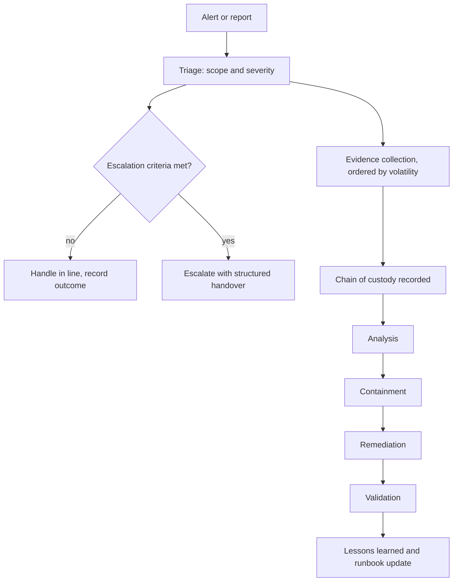

# DFIR Playbook — Digital Forensics & Incident Response

> Operational runbooks, triage scripts and case study templates built from laboratory incident response exercises across a fictional enterprise multi-site lab infrastructure (Site A · Site B · Site C).

---

## About

This repository documents my personal DFIR methodology, tooling, and operational procedures developed through documented laboratory exercises and public guidance.

**Scope of experience:**
- a synthetic enterprise-scale population across multi-site lab (macOS, Windows, Linux)
- Fictional multi-site environment using Site A, Site B and Site C
- Generic endpoint-management and configuration-management platforms
- Active Directory, least privilege and device trust concepts
- Generic monitoring, alerting and dashboard concepts

**Certifications relevant to this repo:**
- ISC2 CC (Certified in Cybersecurity)
- NCI DFIR (National College of Ireland)
- AWS Security Specialty + multiple AWS security certs
- TryHackMe — Active practitioner
- Public training platforms and CTF practice used only for personal learning

---

## Repository Structure

```
dfir-playbook/
├── README.md
├── runbooks/
│   ├── live-triage-linux.md          # Linux live triage procedure
│   ├── live-triage-windows.md        # Windows live triage procedure
│   ├── incident-response-ir.md       # Full IR lifecycle (PICERL)
│   └── malware-analysis-runbook.md   # Malware triage & analysis
├── scripts/
│   ├── bash/
│   │   ├── linux-triage.sh           # Linux automated evidence collection
│   │   ├── memory-capture.sh         # RAM acquisition (LiME/avml)
│   │   └── log-collector.sh          # Centralised log harvesting
│   ├── powershell/
│   │   ├── windows-triage.ps1        # Windows live triage automation
│   │   └── event-log-collector.ps1   # Windows Event Log exporter
│   └── batch/
│       └── quick-triage.bat          # Quick Windows triage (no PS policy issues)
├── case-studies/
│   ├── lost-device-investigation.md  # MDM-assisted lost device DFIR
│   └── credential-breach-response.md # Credential compromise IR scenario
├── tools-reference/
│   ├── dfir-tools-linux.md           # Linux DFIR tool reference
│   └── dfir-tools-windows.md         # Windows DFIR tool reference
└── resources/
    ├── evidence-chain-of-custody-template.md
    └── incident-report-template.md
```

---

## Quick Reference — Triage Priority

| Phase | Linux | Windows |
|-------|-------|---------|
| 1. Volatile data | `linux-triage.sh` | `windows-triage.ps1` |
| 2. Memory | `memory-capture.sh` | WinPmem / DumpIt |
| 3. Logs | `log-collector.sh` | `event-log-collector.ps1` |
| 4. Disk image | `dd` / `dc3dd` | FTK Imager |
| 5. Report | IR template | IR template |

---

## Methodology — PICERL

```
Preparation → Identification → Containment → Eradication → Recovery → Lessons Learned
```

Full procedure in [runbooks/incident-response-ir.md](runbooks/incident-response-ir.md)

---

## Usage

All scripts are designed to be run with **minimum footprint** on the target system. Read the runbook before executing any script in a live environment.

```bash
# Linux triage (run as root)
sudo bash scripts/bash/linux-triage.sh

# Windows triage (run as Administrator)
powershell -ExecutionPolicy Bypass -File scripts\powershell\windows-triage.ps1
```

---

## Disclaimer

These tools and procedures are intended for **authorised incident response** activities only. Always obtain written authorisation before performing forensic investigation on any system.

---

*Marcus Paula | Independent security engineering lab*  
*github.com/marcuspaula-seceng*


## Architecture



## What this repository contains

Runbooks for incident response and live triage on Windows and Linux, malware-analysis
methodology, case studies, chain-of-custody and incident-report templates, and collection
scripts in PowerShell, Bash and batch.

## Methodology

Follows the PICERL sequence — preparation, identification, containment, eradication, recovery
and lessons learned — with evidence collected in order of volatility.

## Validation

The collection scripts were run against controlled test systems. Output was reviewed manually
for completeness. There is no automated test suite and no CI in this repository.

## Limitations

- **These runbooks have not been exercised against a real security incident.** They are
  written procedure, not an incident record.
- Case studies are constructed scenarios, not investigations of real events. No real evidence,
  host name, account or organisational detail appears anywhere in this repository.
- Triage scripts assume administrative rights and a reachable host; they do not handle
  degraded or hostile conditions.
- Nothing here substitutes for a legally supervised forensic process where one is required.

## Lessons learned

Half of what initially looked like attacker activity in a practice case turned out to be the
trace of the collection tooling itself. The correction was to classify ambiguous artefacts by
confidence level rather than fitting them to the incident narrative.

## Future improvements

- Automated validation that each collection script produces the artefacts its runbook claims.
- Tabletop exercises with recorded timings.
- A decision table mapping observed artefacts to escalation criteria.

---

## Project classification

This is an independent technical project using synthetic data and fictional scenarios. It does not contain employer systems, data, documentation or proprietary information.

## Engineering timeline

**Phase 1 — Security baseline.** Define escalation criteria and evidence handling before an
incident, not during one. Collection ordered by volatility; chain of custody recorded from the
first action.

**Phase 2 — Investigation.** Work the PICERL sequence with a written decision path, so triage
does not depend on who happens to be on shift.

**Phase 3 — Automation and validation.** Collection scripts for Windows and Linux, exercised
against controlled test systems, with output reviewed for completeness against what each
runbook claims it produces.

**Phase 4 — Outcome and lessons learned.** In a practice case, half of what initially looked
like attacker activity turned out to be the trace of the collection tooling itself. The
correction was to classify ambiguous artefacts by confidence level rather than fitting them to
the incident narrative. These runbooks have not been exercised against a real incident, and
that limitation is stated rather than hidden.

## Technologies

PowerShell · Bash · Windows batch · Windows Event Log collection · Linux live-response tooling ·
Markdown runbooks and chain-of-custody templates · GitHub Actions for validation

## Testing

Collection scripts were run against controlled test systems and their output reviewed manually
for completeness against what each runbook claims it produces.

Every pull request is validated automatically: PowerShell parse checks, shell syntax checks,
balanced Markdown fences and resolution of every relative link. There is no automated test that
asserts forensic correctness of the collected artefacts — that remains a manual review step,
and it is listed in the improvements below rather than implied to exist.
